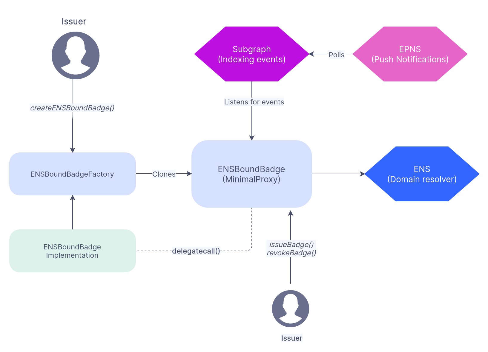
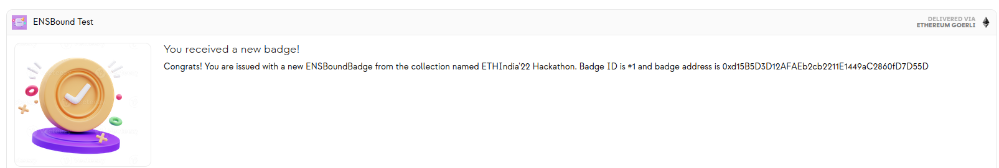
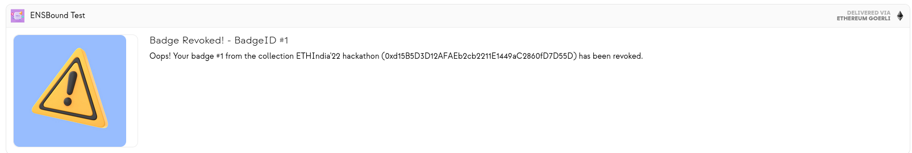

 # ENSBoundBadges •   [](https://opensource.org/licenses/MIT) 

 
A permission-less system that allows anyone to issue on-chain badges that'll be tied forever tied to the user's [**ENS domain**](https://ens.domains). 


> **Warning**
>
> These contracts are **unaudited** and are not recommended for use in production. Due to time constraints, there are no automated unit tests available yet, the system is MANUALLY TESTED as of now.
>
> This is **experimental software** and is provided on an "as is" and "as available" basis.
> There are **no warranties** and we **will not be liable for any loss** incurred through any use of this codebase.

 
## What?

Inspired by [Vitalik's blog on Soulbound token](https://vitalik.ca/general/2022/01/26/soulbound.html), I wanted to build something cool and interesting for ETHIndia'22 hackathon. 

For those who don't know:

*A soulbound item, once picked up, cannot be transferred or sold to another account.While transferable NFTs have their place and can be really valuable on their own for supporting artists and charities, there is also a large and underexplored design space of what non-transferable NFTs could become.*

The system is completely **permissionless** such that anyone could issue their own badges on-chain with their own icons (passed as `BadgeInfo`) for any purpose, it could be issued for hackathon winners, for bug bounty hunters, for CTF Challenge solvers, for gas optmizooors and for anyone they want. And the cool part is whenever a new badge is issued or revoked, the address associated with the ENS will receive a push notification via [**Push protocol**](https://push.org) and [**Graph protocol**](https://thegraph.com) integration!

---

## System Overview:



## Smartcontracts Overview:

From the above architecture diagram, you can see there are a couple of important contracts.

- [ENSBoundBadge](https://github.com/PraneshASP/ens-bound-badges/blob/main/src/ENSBoundBadge.sol): This is the core contract that's used to issue or revoke badges. It is `ERC721` compatible but cannot be transferred. For every event, a new `ENSBoundBadge` contract has to be deployed. For example, we cannot use the same ENSBoundBadge contract for both ETHIndia hackathon and Paradigm's CTF contest. There should be a new collection deployed for different occasions. This is the contract that also interacts with the ENS contracts to resolve domain names.
  
- [ENSBoundBadgeFactory](https://github.com/PraneshASP/ens-bound-badges/blob/main/src/ENSBoundBadgeFactory.sol): This is a factory contract that is used to deploy (clone) the `ENSBoundBadge` contract. This contract uses EIP-1167 (Minimal proxy) standard to create new ENSBoundBadge contracts saving gas fees on deployment. 

---

Here are some quick screenshots of the push notifications received.

- **When a badge is issued:**
  
   

- **When a badge is revoked:**
  

## Getting Started

### Requirements

The following will need to be installed in order to use this repo. Please follow the links and instructions.

- [Git](https://git-scm.com/book/en/v2/Getting-Started-Installing-Git)
  - You'll know you've done it right if you can run `git --version`
- [Foundry / Foundryup](https://github.com/gakonst/foundry)
  - This will install `forge`, `cast`, and `anvil`
  - You can test you've installed them right by running `forge --version` and get an output like: `forge 0.2.0 (f016135 2022-07-04T00:15:02.930499Z)`
  - To get the latest of each, just run `foundryup`
 

### Quickstart

1. Clone this repo:

```
git clone https://github.com/PraneshASP/ens-bound-badges
cd ens-bound-badges
```

2. Install dependencies

Once you've cloned and entered into your repository, you need to install the necessary dependencies. In order to do so, simply run:

```shell
forge install
```

3. Build

To build your contracts, you can run:

```shell
forge build
```

1. Deployment

Create a `.env` file and copy the contents of `.env.examples` to it.
Update the fields with relavant values.

To proceed with the deployment, run the following command...

```shell
source .env

forge script scripts/Deploy.s.sol:Deploy --fork-url $POLYGON_INFURA_RPC_URL --private-key $PRIVATE_KEY --broadcast
```

For more information on how to use Foundry, check out the [Foundry Github Repository](https://github.com/foundry-rs/foundry/tree/master/forge).

## Blueprint

```ml
scripts
├─ Deploy.s.sol — Deployment Script
src
├─interfaces
|    ├─ IENSBoundBadge.sol - The ENSBoundBadge token interface
|    └─ IENS.sol - Interface containing methods to resolve ENS domain names.
├─ ENSBoundBadge.sol — The ENSBoundBadge token contract
├─ ENSBoundBadgeFactory.sol - Factory contract to deploy new badge contracts
├─ ERC721Initializable.sol - Modified ERC721 contract from solmate to support Clones.
|
subgraph
    ├─ abis - ENSBoundBadge and factory contract ABI for the Subgraph schema and mappings
    ├─ src - Contains mapping and other helper methods for EPNS integration
    ├─ schema.graphql - Contains all the entity definitions
    └─ subgraph.yaml - Includes templates and data sources for indexing

```

## License

[MIT](https://github.com/PraneshASP/ens-bound-badges/blob/master/LICENSE)

## Next Steps

- [ ] Add unit tests and integration tests
- [ ] Build frontend/UI/CLI
- [ ] Improve subgraph - Add more entities
- [ ] Fully on-chain badges?
- [ ] Integrate with other ID services like UnstoppableDomains, etc.,

## Disclaimer

_These smart contracts are being provided as is. No guarantee, representation or warranty is being made, express or implied, as to the safety or correctness of the user interface or the smart contracts. They have not been audited and as such there can be no assurance they will work as intended, and users may experience delays, failures, errors, omissions, loss of transmitted information or loss of funds. The creators are not liable for any of the foregoing. Users should proceed with caution and use at their own risk._
